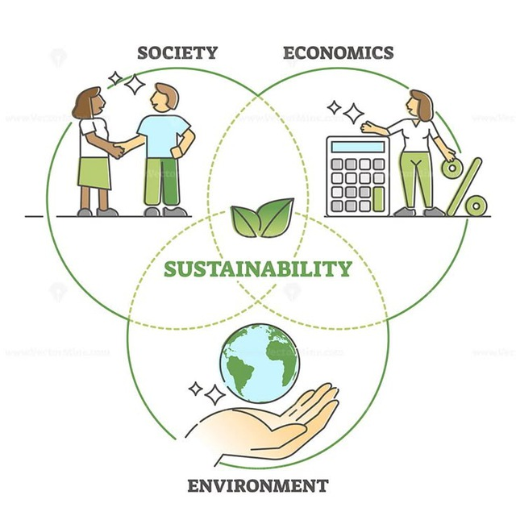

# Sustainability Seeker Telegram Bot



Welcome to the **Sustainability Seeker** Telegram Bot! 🌍✨ This bot connects users to global communities focused on climate action and sustainability. 

## Features
- **Community Links:** Access links to various global communities working on different aspects of climate action.
- **User Contributions:** Join and contribute to discussions, initiatives, and projects related to sustainability.
- **User-Friendly Interface:** Intuitive screens for easy navigation and interaction.

## Usage
Start a chat with the bot on Telegram: [@SustainabilitySeekerBot](https://t.me/SustainabilitySeekerBot).  
Follow the prompts to explore community links and contribute to sustainability efforts.

## Contributing
We welcome contributions! If you have suggestions or improvements, please follow these steps:
1. Fork the repository.
2. Create a new branch:
   ```bash
   git checkout -b feature/YourFeature
3. Make your changes and commit:
   ```bash
   git commit -m "Add some feature"
4. Push to the branch:
   ```bash
   git push origin feature/YourFeature
5. Open a pull request.

License
This project is licensed under the MIT License.

Thank you for checking out the Sustainability Seeker Telegram Bot! Together, we can make a positive impact on our planet. 🌱

